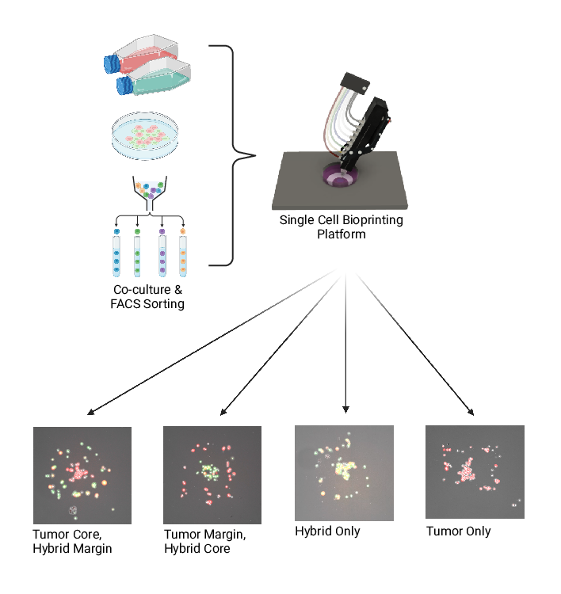
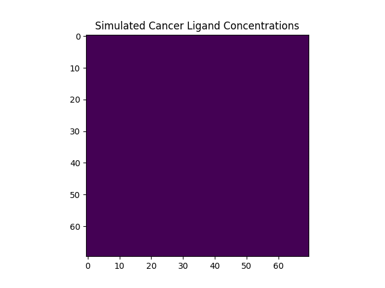

# APSA-ASCI-AAPI Joint Meeting 2024

Bioprint Sample Preparation

## Example Simulations
Gifs are organized by spatial location of the initial conditions for each simulation and show examples of simulations that differ by the chemotaxis sensitivity of hybrid cells to a simulated cancer secretant.

Hybrid Margin, Tumor Core

<h3 >Example</h3>

| sim-f3c34d11a024be4a10c1a01fde0eb7bc | sim-a32056bd58aa8e988db807474eee0742 | 
|--|--|  
| Cancer substrate sensitivity = 0.94 | Cancer substrate sensitivity = 0.39 |  
|  |  |  
|  | |

Hybrid Core, Tumor Margin

<h3 >Example</h3>

| sim-5f32272f105002a044f8aa0bbf0a0231 | sim-39c031049a9066f1d9933c99f41c319e | 
|--|--|  
| Cancer substrate sensitivity = 0.80 | Cancer substrate sensitivity = 0.27 |  
|  |  |  
|  |  |

## Bioprinting the TME

>Multiplex Single-Cell Bioprinting for Engineering of Heterogeneous Tissue Constructs with Subcellular Spatial Resolution
Haylie R. Helms, Kody A. Oyama, Jason P. Ware, Stuart D. Ibsen, Luiz E. Bertassoni
bioRxiv 2024.02.01.578499; doi: https://doi.org/10.1101/2024.02.01.578499

Patterned vs random (“co-culture”) prints containing MCF10A, MDA-MB-231, and mammary fibroblasts. Live cell images at 0, 3, and 12 hours. Immunofluorescence staining for pan cytokeratin (PanCK), vimentin (VIM), and nucleus (DAPI). 

### Test Environment for Adapting Bioprints to ABM

Hybrid Margin, Tumor Core

<h3 >Replicate #1</h3>

| Hybrid Margin, Tumor Core | Hybrid Core, Tumor Margin | 
|--|--|   
|  |  |  

Hybrid cells are joint GFP-RFP fusions of macrophages and colorectal tumor cells. They appear green and yellow on the liver cell imaging. Colorectal tumor cells are RFP positive.

